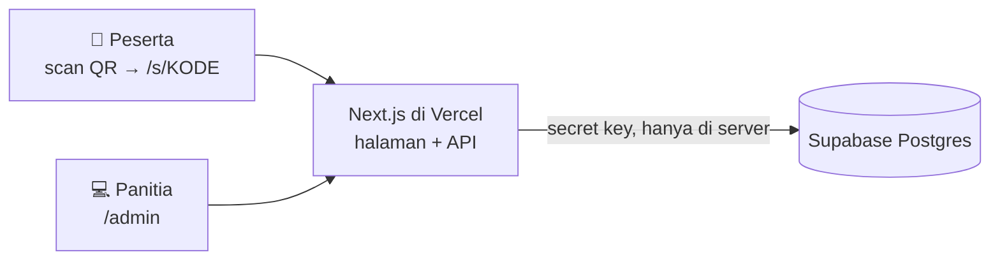

<p align="center">
  
</p>

<h1 align="center">UjiKSR</h1>

<p align="center">
  Web ujian <b>pre-test & post-test</b> dengan anti-cheat untuk <b>KSR PMI Unit Universitas Telkom</b>.<br>
  Peserta masuk lewat scan QR dari HP. Panitia mengelola sesi, soal, dan nilai dari satu panel.
</p>

<p align="center">
  <a href="https://ujiksr.vercel.app"><b>ujiksr.vercel.app</b></a> ·
  <a href="docs/PANDUAN.md"><b>Buku Panduan</b></a> ·
  <a href="#mulai-cepat">Mulai cepat</a> ·
  <a href="#anti-cheat">Anti-cheat</a>
</p>

<p align="center">
  
  
  
  
  
  
</p>

<table align="center">
  <tr>
    <td align="center"><br><sub>Masuk dengan kode / QR</sub></td>
    <td align="center"><br><sub>Mengerjakan soal</sub></td>
    <td align="center"><br><sub>Peringatan pelanggaran</sub></td>
    <td align="center"><br><sub>Nilai muncul serentak</sub></td>
  </tr>
</table>

<p align="center">
  
</p>

## Fitur

**Untuk peserta**
- Tanpa akun: scan QR, isi nama dan NIM, langsung mulai.
- Dua mode timer: **total** (bebas bolak-balik antar soal) atau **per soal** (tidak bisa kembali ke soal sebelumnya).
- Soal dan urutan opsi diacak untuk tiap peserta.
- Timer dan penilaian dihitung server, jadi tidak bisa diakali dari HP.
- Animasi selamat setelah selesai, dan nilai muncul serentak untuk semua peserta setelah sesi ditutup.
- Tampilan terang/gelap, nyaman di HP dan laptop.

**Untuk panitia** (`/admin`)
- Buat sesi pre-test/post-test lengkap dengan tanggal, mode timer, dan batas pelanggaran.
- Soal lewat form manual atau upload CSV dari Excel/Google Sheets.
- Halaman **Tayangkan QR & kode** untuk share screen atau proyektor: QR dan kode sesi dalam ukuran besar, tanpa daftar soal dan kunci jawaban. Sesi dibuka/ditutup dengan satu klik.
- Pantau peserta secara langsung: nilai, status, dan log pelanggaran lengkap dengan jam. Halaman memperbarui diri tiap 10 detik.
- Hitung mundur sampai nilai tampil di HP peserta.
- Export hasil ke CSV, reset peserta, hapus sesi.
- Bandingkan pre-test vs post-test per peserta (dicocokkan lewat NIM) beserta rata-rata peningkatannya.

<p align="center">
  <br>
  <sub>Tayangkan QR & kode: aman di-share screen, tanpa kunci jawaban</sub>
</p>

<p align="center">
  
</p>

## Anti-cheat

| | Yang dilakukan |
|---|---|
| **Dicegah** | Mode layar penuh dan layar terkunci sampai kembali ke layar penuh · tekan-lama, salin, dan seleksi teks diblokir (menutup jalan Google Lens dan copy-paste ke AI) · watermark nama + NIM di seluruh layar · layar dijaga tetap menyala |
| **Dideteksi** (dicatat sebagai pelanggaran) | Pindah aplikasi/tab · hilang fokus (notifikasi, overlay) · keluar layar penuh · split screen / jendela mengecil · reload atau membuka ulang ujian. Pelanggaran ke-*N* mengumpulkan jawaban otomatis. |
| **Dijaga server** | Timer dari server · soal dan opsi diacak per peserta · kunci jawaban tidak pernah dikirim ke HP · 1 NIM = 1 kali per sesi · mode per soal tidak bisa kembali · nilai baru muncul setelah semua selesai |

**Keterbatasan aplikasi web:** tidak bisa memblokir screenshot atau foto dari HP lain. Watermark membantu melacak siapa yang menyebarkan. iPhone tidak mendukung layar penuh, jadi di sana yang terdeteksi adalah pindah aplikasi/tab. Pengawas di ruangan tetap perlu. Rinciannya ada di [Buku Panduan](docs/PANDUAN.md#6-anti-cheat-secara-rinci).

## Cara kerja



- Browser **tidak pernah** berbicara langsung dengan Supabase. Semua lewat API Next.js dengan secret key. RLS aktif tanpa policy, jadi anon key tidak bisa membaca apa pun.
- Aturan ujian (acak soal, timer, lewati soal saat waktunya habis, penilaian) berupa fungsi murni di `lib/exam.ts`, diuji dengan unit test.
- Penulisan jawaban dan pelanggaran memakai fungsi SQL atomik (`record_answer`, `add_violation`), sehingga request yang datang bersamaan tidak saling menimpa.

## Mulai cepat

Kebutuhan: [Bun](https://bun.sh) 1.2+, akun [Supabase](https://supabase.com), dan akun [Vercel](https://vercel.com) untuk deploy.

1. **Database.** Buat project Supabase → **SQL Editor** → jalankan seluruh isi [`supabase/schema.sql`](supabase/schema.sql).
2. **Environment.** Salin `.env.example` ke `.env.local`, lalu isi:

   | Variabel | Isi |
   |---|---|
   | `SUPABASE_URL` | `https://xxxx.supabase.co` (Project Settings → API) |
   | `SUPABASE_SECRET_KEY` | Secret key `sb_secret_…` atau `service_role`, **bukan** anon/publishable key |
   | `ADMIN_PASSWORD` | Password panel `/admin`. Pakai minimal 16 karakter acak. Kalau diganti, semua admin otomatis logout. |

3. **Jalankan.**

   ```bash
   bun install
   bun run dev        # buka http://localhost:3000/admin
   ```

### Deploy ke Vercel

1. Import repo ini di Vercel, isi tiga variabel di atas untuk environment **Production**, lalu deploy. QR di panel admin otomatis memakai domain Vercel.
2. **Samakan region fungsi dengan region Supabase.** Setiap aksi peserta melakukan beberapa query berurutan, jadi region yang berjauhan menambah sekitar 0,2 detik per query. [`vercel.json`](vercel.json) saat ini memakai `hnd1` (Tokyo) karena project Supabase-nya di `ap-northeast-1`. Kalau Supabase-mu di Singapura (`ap-southeast-1`), ganti ke `sin1`.

### Upgrade database lama

Perubahan skema dicatat di bagian atas `supabase/schema.sql`. Contohnya kolom tanggal sesi (`held_on`) untuk database yang dibuat sebelum fitur itu ada. Jalankan SQL tersebut di Supabase **sebelum** merge ke `master`, karena setiap merge langsung ter-deploy ke production.

## Format soal CSV

Kolom: `type,question,a,b,c,d,e,answer`. Contoh lengkap ada di [`public/contoh-soal.csv`](public/contoh-soal.csv).

| Kolom | Isi |
|---|---|
| `type` | `pg` = pilihan ganda, `bs` = benar/salah (`mc`/`tf` juga diterima) |
| `question` | Teks soal |
| `a` … `e` | Opsi pilihan ganda, diisi berurutan mulai dari `a`, minimal 2. Kosongkan untuk `bs`. |
| `answer` | Huruf opsi yang benar (`A`–`E`), atau `B` (benar) / `S` (salah) |

```csv
type,question,a,b,c,d,e,answer
pg,Apa kepanjangan dari KSR?,Korps Sukarela,Kelompok Siaga Relawan,Komunitas Sosial Remaja,Korps Siaga Rakyat,,A
bs,Tourniquet adalah pilihan pertama untuk semua jenis perdarahan.,,,,,,S
```

Dari Excel atau Google Sheets, pilih **Save As / Download → CSV**. Pemisah koma atau titik koma (Excel versi Indonesia) terdeteksi otomatis. File `.xlsx` ditolak dengan pesan yang jelas.

## Dukungan perangkat & kapasitas

| Perangkat | Browser | Versi minimum |
|---|---|---|
| Android | Chrome, Samsung Internet, Edge, Firefox | Chrome 111+ (rilis 2023) |
| iPhone / iPad | Safari | iOS 16.4+ (iPhone 8 ke atas) |
| Laptop | Chrome, Edge, Firefox, Safari | Chrome 111+ / Safari 16.4+ |

Browser yang lebih lama melihat peringatan untuk memperbarui browser. Link yang dibuka dari dalam aplikasi Instagram/LINE/TikTok tetap bisa dipakai ujian, tapi peserta disarankan membukanya di Chrome atau Safari.

**Kapasitas.** Sudah diuji dengan 150 peserta simulasi yang join, menjawab, submit, dan mengambil nilai pada detik yang sama. Semua request berhasil tanpa error. Batas utama ada di jumlah request ke Supabase: paket gratis sekitar 40 request/detik. Project Supabase gratis juga otomatis di-pause setelah 7 hari tidak dipakai, jadi **buka `/admin` sehari sebelum ujian**. Ukur sendiri dengan:

```bash
# buat sesi uji di /admin, buka sesinya, lalu (hapus sesi itu setelahnya):
BASE=https://ujiksr.vercel.app CODE=ABC123 N=150 bun e2e/load.ts
```

## Pengembangan

```bash
bun test          # unit test + skema database di PGlite (Postgres in-memory)
bun run lint      # ESLint
bun run build     # build + type-check
bun run e2e       # uji end-to-end penuh tanpa akun Supabase:
                  # PGlite → PostgREST → next dev :3100 → Chromium headless
```

E2E butuh Chromium. Set `CHROMIUM_PATH` kalau lokasinya bukan `/usr/bin/chromium-browser`. Log dan screenshot kegagalan ada di `e2e/.bin/`.

<details>
<summary><b>Struktur proyek</b></summary>

```
app/
  page.tsx               beranda: masukkan kode sesi
  s/[code]/              halaman join (aturan ujian, nama + NIM)
  exam/[id]/             halaman ujian + anti-cheat (use-anti-cheat.ts)
  api/attempts/          API peserta: mulai, lihat, jawab, submit, pelanggaran
  admin/                 panel panitia (server actions di actions.ts)
lib/
  exam.ts                aturan murni: acak soal, timer, penilaian, data untuk peserta
  attempts.ts            orkestrasi database per request
  fullscreen.ts          layar penuh + fallback untuk browser yang menolaknya
  csv.ts · report.ts     parser CSV soal · perbandingan pre/post
supabase/schema.sql      tabel, RLS, fungsi SQL atomik
e2e/                     uji end-to-end dan uji beban (load.ts)
docs/                    buku panduan + screenshot
```

</details>

<details>
<summary><b>Keamanan</b></summary>

- Secret key Supabase hanya ada di server (`lib/db.ts`). RLS aktif tanpa policy.
- Kunci jawaban tidak pernah keluar dari server. Nilai hanya dikirim ke peserta setelah dirilis.
- Login admin memakai cookie HMAC (httpOnly, berlaku 12 jam). Setiap server action memeriksa login sendiri.
- Header keamanan: tidak bisa di-iframe (anti-clickjacking), `nosniff`, dan `Referrer-Policy: same-origin`, karena link `/exam/<id>` adalah kunci peserta.
- API pelanggaran hanya menerima 5 jenis resmi. Export CSV kebal formula Excel.

</details>

## Dokumentasi

- **[Buku Panduan](docs/PANDUAN.md)** untuk panitia dan peserta: langkah demi langkah, checklist hari-H, dan pemecahan masalah.
- [Spesifikasi desain](docs/superpowers/specs/2026-09-27-ujian-ksr-anticheat-design.md)
- [`CLAUDE.md`](CLAUDE.md): catatan arsitektur untuk pengembang.

---

<p align="center"><sub>Dibuat untuk KSR PMI Unit Universitas Telkom.</sub></p>
