<p align="center">
  
</p>

<h1 align="center">Buku Panduan UjiKSR</h1>

<p align="center">
  Panduan penggunaan web ujian pre-test & post-test <b>KSR PMI Unit Universitas Telkom</b><br>
  untuk <b>panitia</b> dan <b>peserta</b>.
</p>

<p align="center"><a href="https://ujiksr.vercel.app">ujiksr.vercel.app</a></p>

---

## Daftar isi

1. [Sekilas UjiKSR](#1-sekilas-ujiksr)
2. [Persiapan panitia](#2-persiapan-panitia)
3. [Saat ujian berlangsung](#3-saat-ujian-berlangsung)
4. [Panduan peserta](#4-panduan-peserta)
5. [Checklist hari-H](#5-checklist-hari-h)
6. [Anti-cheat secara rinci](#6-anti-cheat-secara-rinci)
7. [Pertanyaan umum & pemecahan masalah](#7-pertanyaan-umum--pemecahan-masalah)
8. [Lampiran](#8-lampiran)

---

## 1. Sekilas UjiKSR

UjiKSR adalah web untuk menjalankan pre-test dan post-test diklat KSR. Peserta cukup memakai HP: scan QR, isi nama dan NIM, lalu mengerjakan soal. Peserta tidak perlu membuat akun atau memasang aplikasi. Panitia mengatur semuanya dari panel admin di laptop.

**Alur singkat**

1. Panitia membuat **sesi** (misalnya "Pre-test Diklat Dasar KSR 2026") lalu mengisi soal.
2. Panitia **membuka sesi** dan menayangkan QR-nya.
3. Peserta scan QR, mengisi nama + NIM, dan mengerjakan soal dalam layar penuh.
4. Panitia memantau nilai dan pelanggaran secara langsung.
5. Sesi **tutup otomatis** setelah durasi ujian (atau ditutup panitia lebih awal). Setelah semua peserta selesai, nilai muncul serentak di HP masing-masing.
6. Setelah post-test, panitia **membandingkan** hasil pre-test dan post-test.

**Istilah**

| Istilah | Arti |
|---|---|
| Sesi | Satu ujian: pre-test *atau* post-test, dengan soal dan pengaturannya sendiri. |
| Kode sesi | 6 karakter (misalnya `LWG5QF`) yang ada di QR dan link sesi. |
| Mode timer | **Total**: satu waktu untuk semua soal, bebas bolak-balik. **Per soal**: tiap soal punya waktu sendiri dan tidak bisa kembali. |
| Pelanggaran | Tindakan yang tercatat saat ujian, misalnya pindah aplikasi atau keluar layar penuh. |
| Batas pelanggaran | Pada pelanggaran ke-*N*, jawaban peserta otomatis dikumpulkan. |

---

## 2. Persiapan panitia

### 2.1 Masuk ke panel admin

Buka **`https://ujiksr.vercel.app/admin`** di laptop, lalu masukkan password panitia. Login berlaku 12 jam.

<p align="center">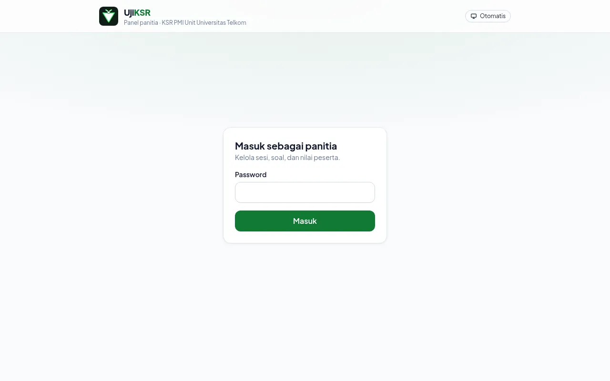</p>

> Password diatur oleh pengelola aplikasi lewat variabel `ADMIN_PASSWORD` di Vercel. Jangan bagikan password ke peserta.

### 2.2 Membuat sesi

Di halaman **Sesi ujian**, isi form **Buat sesi baru**, lalu klik **Buat sesi**.

<p align="center">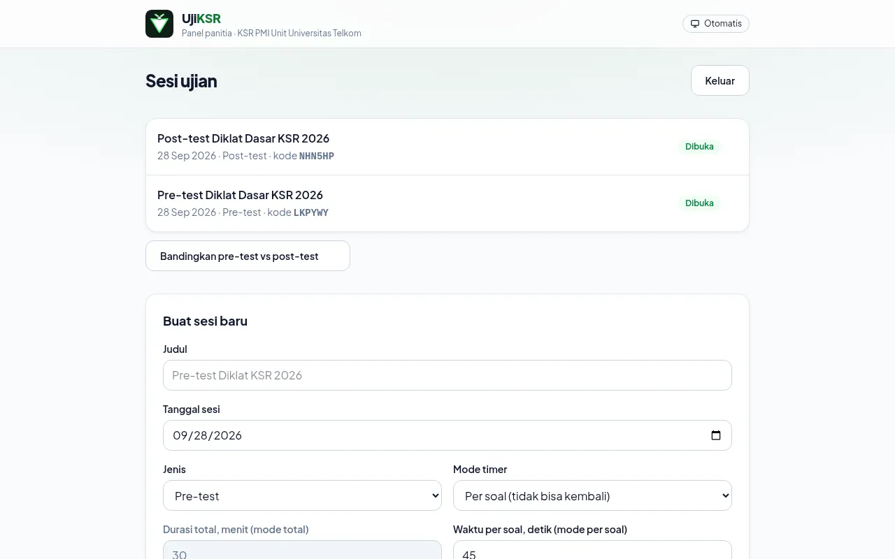</p>

| Isian | Keterangan |
|---|---|
| **Judul** | Nama ujian, maksimal 120 karakter. Contoh: *Pre-test Diklat Dasar KSR 2026*. |
| **Tanggal sesi** | Tanggal pelaksanaan. Dipakai untuk mengurutkan dan membedakan sesi. |
| **Jenis** | *Pre-test* atau *Post-test*. Menentukan sesi mana yang bisa dibandingkan. |
| **Mode timer** | *Per soal*: tiap soal punya waktu dan tidak bisa kembali; paling ketat. *Total*: satu waktu untuk semua soal dan bebas bolak-balik. |
| **Durasi total** | 1–600 menit. Hanya dipakai di mode total. |
| **Waktu per soal** | 5–600 detik. Hanya dipakai di mode per soal. Total waktunya = waktu per soal × jumlah soal. |
| **Batas pelanggaran** | 1–20. Pada pelanggaran ke-*N*, jawaban dikumpulkan otomatis. Rekomendasi: 3. |

Setelah dibuat, kamu langsung masuk ke halaman sesi. Kode sesi dibuat otomatis (6 karakter, tanpa huruf O/I dan angka 0/1 supaya tidak tertukar).

### 2.3 Menyiapkan soal

Ada dua cara, dan keduanya bisa digabung.

**a. Tambah soal manual.** Klik **+ Tambah soal manual**, pilih jenis soal (*Pilihan ganda* atau *Benar / Salah*), tulis pertanyaan, isi opsi A, B, dan seterusnya secara berurutan (minimal A dan B), pilih jawaban benar, lalu klik **Tambah soal**.

<p align="center">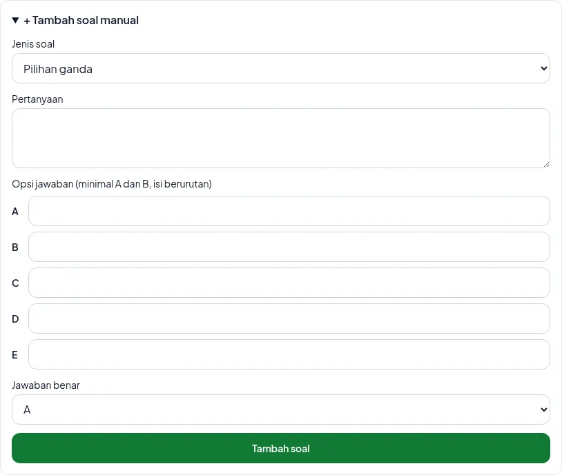</p>

**b. Upload CSV** untuk banyak soal sekaligus. Buka **Upload CSV (ganti semua soal)**, pilih file `.csv`, lalu klik **Upload & ganti semua soal**. Upload **mengganti semua soal** yang sudah ada.

<p align="center">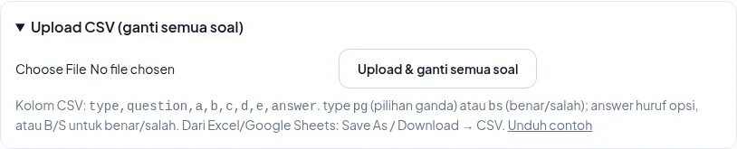</p>

- Klik **Unduh contoh** untuk mendapatkan template.
- Dari Excel: *File → Save As → CSV*. Dari Google Sheets: *File → Download → CSV*.
- File Excel (`.xlsx`) ditolak. Simpan dulu sebagai CSV.
- Kalau ada baris yang salah, upload dibatalkan dan nomor barisnya ditampilkan. Soal lama tetap aman.
- Format lengkapnya ada di [Lampiran A](#a-format-csv-soal).

**Periksa kunci jawaban.** Di daftar soal, jawaban benar ditandai **hijau dengan ✓**. Periksa sebelum membuka sesi: begitu ada peserta yang mulai, soal **terkunci** dan tidak bisa diubah lagi.

> **Kenapa terkunci?** Setiap peserta mendapat urutan soal dan opsi acak saat mulai. Mengubah soal di tengah jalan bisa merusak penilaian. Untuk mengubah soal setelah ada peserta, klik **Reset semua** di bagian Peserta. Semua jawaban peserta ikut terhapus. Mode timer, durasi, dan waktu per soal juga terkunci dengan alasan yang sama.

### 2.4 Membuka sesi dan menayangkan QR

Klik **Buka sesi**. Status berubah menjadi *Sesi dibuka — peserta bisa mulai*.

<p align="center">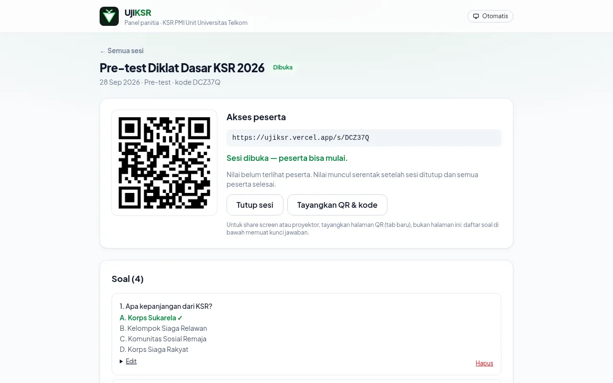</p>

Untuk share screen (Zoom/Meet) atau proyektor, klik **Tayangkan QR & kode**. Halaman khusus terbuka di tab baru. Isinya hanya judul sesi, QR besar, dan kode sesi besar, sehingga peserta di bagian belakang ruangan pun bisa scan atau mengetik kodenya. Klik **Layar penuh** supaya tampilannya memenuhi layar. Status sesi di halaman ini juga ikut berubah sendiri kalau sesi dibuka atau ditutup dari tab lain.

<p align="center">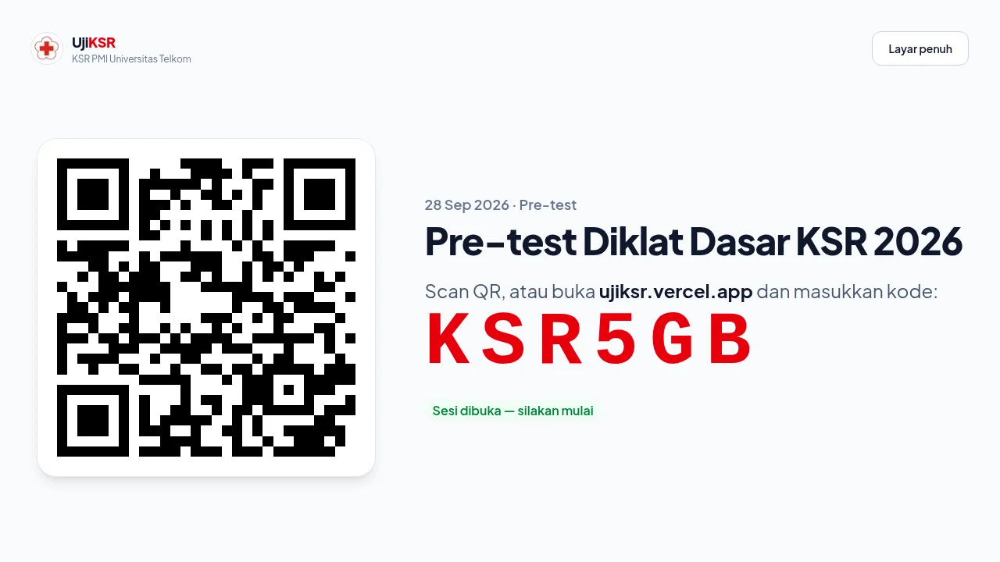</p>

> ⚠️ **Jangan share screen halaman sesi admin.** Daftar soal di halaman itu menampilkan kunci jawaban (✓ hijau). Yang di-share cukup tab **Tayangkan QR & kode**.

- Link di bawah QR juga bisa dibagikan ke grup peserta.
- Selama sesi **ditutup**, peserta tidak bisa memulai ujian.
- Sesi **tutup otomatis** setelah durasi ujian, dihitung sejak **Buka sesi** ditekan (mode total: durasi total; mode per soal: jumlah soal × waktu per soal). Halaman sesi menampilkan hitung mundurnya. Jadi tekan **Buka sesi** saat peserta siap mulai, bukan saat briefing.
- Peserta juga bisa masuk dengan mengetik kode sesi di halaman depan **ujiksr.vercel.app**.

---

## 3. Saat ujian berlangsung

### 3.1 Memantau peserta

Bagian **Peserta** menampilkan semua peserta beserta nilai, jumlah pelanggaran, dan statusnya. Halaman **memperbarui diri tiap 10 detik**, jadi tidak perlu di-refresh.

<p align="center">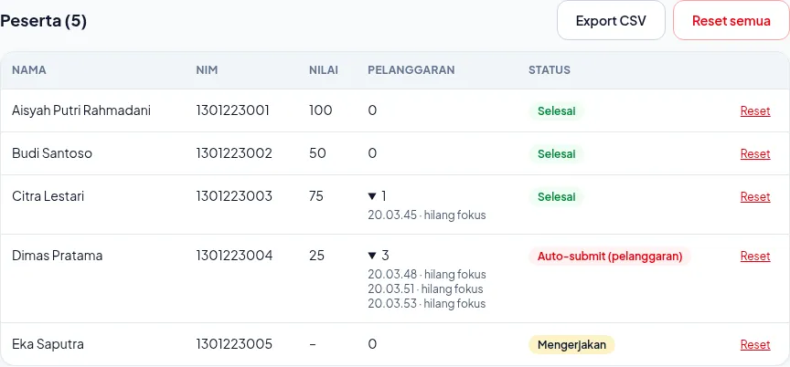</p>

| Status | Arti |
|---|---|
| **Mengerjakan** | Peserta sedang mengerjakan. Kolom nilai masih `–`. |
| **Selesai** | Peserta mengumpulkan jawaban sendiri. |
| **Waktu habis** | Waktu habis sebelum peserta mengumpulkan. Jawaban yang sudah terisi tetap dinilai. |
| **Auto-submit (pelanggaran)** | Jawaban dikumpulkan otomatis karena batas pelanggaran tercapai. |

Klik angka di kolom **Pelanggaran** untuk melihat log-nya: jam kejadian dan jenis pelanggaran (pindah aplikasi/tab, hilang fokus, keluar layar penuh, layar mengecil, membuka ulang ujian).

### 3.2 Menangani masalah peserta

- **"NIM ini sudah memulai ujian di sesi ini"**: satu NIM hanya bisa mengerjakan satu kali per sesi. Kalau peserta memang perlu mengulang (misalnya salah ketik nama, HP mati, atau ganti HP), klik **Reset** di baris peserta itu. Jawabannya terhapus dan dia bisa mulai lagi dari awal.
- **Peserta menutup browser tanpa sengaja**: minta dia membuka lagi QR/link di HP dan browser yang sama, lalu tekan **Lanjutkan ujian**. Waktu tetap berjalan di server, dan membuka ulang tercatat sebagai satu pelanggaran.
- **Peserta ganti HP**: pengerjaan tidak bisa dilanjutkan di HP lain. Gunakan **Reset**, lalu peserta mulai ulang.

### 3.3 Menutup sesi dan merilis nilai

Sesi tutup sendiri setelah durasi ujian sejak dibuka. Panitia juga bisa menutupnya lebih awal dengan **Tutup sesi**, atau membukanya lagi dengan **Buka sesi** (hitung mundurnya mulai dari awal). Setelah sesi tutup, peserta baru tidak bisa masuk lagi. Peserta yang sudah mulai tetap mendapat waktu penuh.

Nilai baru muncul di HP peserta kalau **sesi sudah ditutup dan semua peserta sudah selesai**. Jadi peserta yang selesai duluan tidak bisa membocorkan nilai atau jawaban ke yang masih mengerjakan.

- Peserta yang sudah selesai melihat **hitung mundur** sampai sesi tutup dan waktu peserta terakhir habis. Setelah itu nilai muncul serentak, tanpa perlu refresh.
- Panitia melihat hitung mundur yang sama di halaman sesi, beserta jam rilisnya.
- Setelah nilai muncul, halaman sesi menampilkan *Nilai sudah terlihat oleh peserta di HP masing-masing*.

### 3.4 Export, reset, dan hapus sesi

| Tombol | Fungsi |
|---|---|
| **Export CSV** | Mengunduh `hasil-KODE.csv` berisi nama, NIM, nilai, pelanggaran, status, jam mulai, dan jam selesai. Bisa dibuka di Excel. |
| **Reset** (per peserta) | Menghapus pengerjaan satu peserta supaya dia bisa mulai ulang. |
| **Reset semua** | Menghapus semua peserta beserta jawabannya. Soal dan timer bisa diubah lagi setelah ini. |
| **Hapus sesi** (di Pengaturan) | Menghapus sesi beserta seluruh soal dan peserta. **Tidak bisa dibatalkan**, jadi export dulu kalau hasilnya masih perlu. |

Judul, tanggal, jenis, dan batas pelanggaran tetap bisa diubah di **Pengaturan** kapan saja.

### 3.5 Membandingkan pre-test dan post-test

Dari halaman **Sesi ujian**, klik **Bandingkan pre-test vs post-test**, pilih sesi pre-test dan post-test, lalu klik **Bandingkan**.

<p align="center">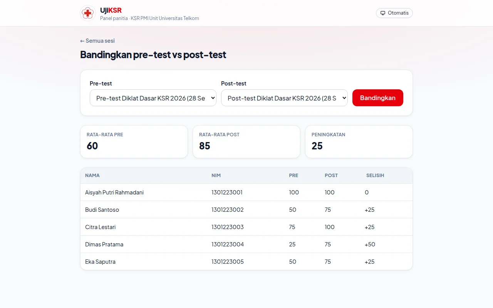</p>

- Peserta dicocokkan lewat **NIM**, jadi pastikan peserta mengetik NIM yang sama di kedua ujian.
- Ditampilkan rata-rata pre, rata-rata post, dan rata-rata peningkatan, serta selisih nilai tiap peserta.
- Peserta yang hanya ikut salah satu ujian ditampilkan dengan tanda `–`.

---

## 4. Panduan peserta

> Bagian ini bisa dibagikan ke peserta sebelum ujian.

### 4.1 Sebelum mulai

- Pakai **Chrome** (Android) atau **Safari** (iPhone). Jangan membuka link dari dalam aplikasi Instagram, LINE, atau TikTok.
- Pastikan baterai cukup dan internet stabil.
- Aktifkan mode **Jangan Ganggu** dan tutup aplikasi lain.
- Siapkan **NIM**. Ketik NIM yang sama persis di pre-test dan post-test.

### 4.2 Masuk ujian

Scan QR dari panitia, atau buka **ujiksr.vercel.app** lalu ketik kode sesi. Baca aturan ujian, isi **Nama lengkap** dan **NIM**, lalu tekan **Mulai ujian**. Layar otomatis masuk mode layar penuh.

<table align="center">
  <tr>
    <td align="center">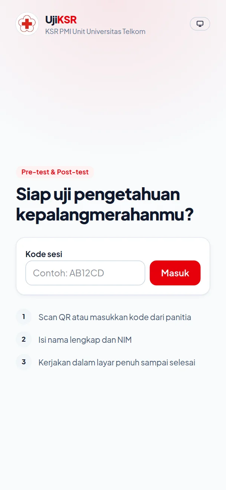<br><sub>Halaman depan</sub></td>
    <td align="center">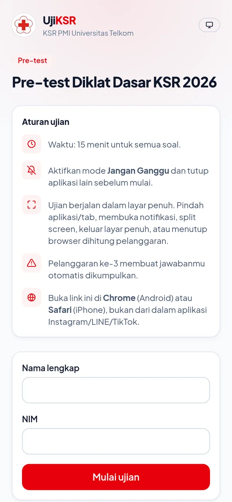<br><sub>Aturan ujian & data diri</sub></td>
  </tr>
</table>

### 4.3 Mengerjakan soal

Di bagian atas layar ada judul ujian, jumlah pelanggaran, dan **sisa waktu**. Timer berwarna merah saat sisa waktunya di bawah 10 detik. Garis merah di bawah header menunjukkan kemajuan. Nama dan NIM-mu tampil samar di seluruh layar sebagai watermark.

<table align="center">
  <tr>
    <td align="center">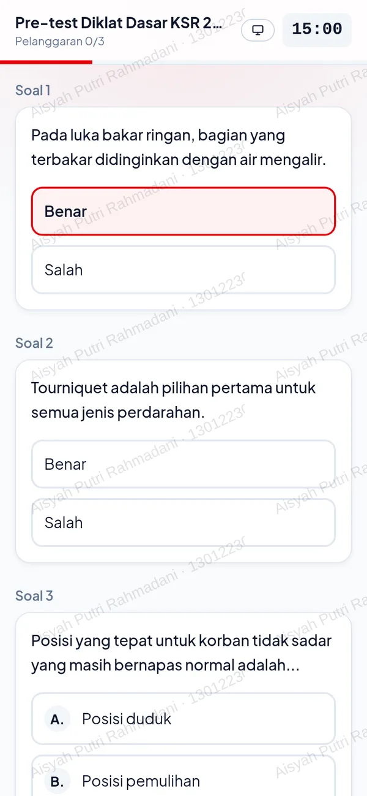<br><sub>Mode total</sub></td>
    <td align="center">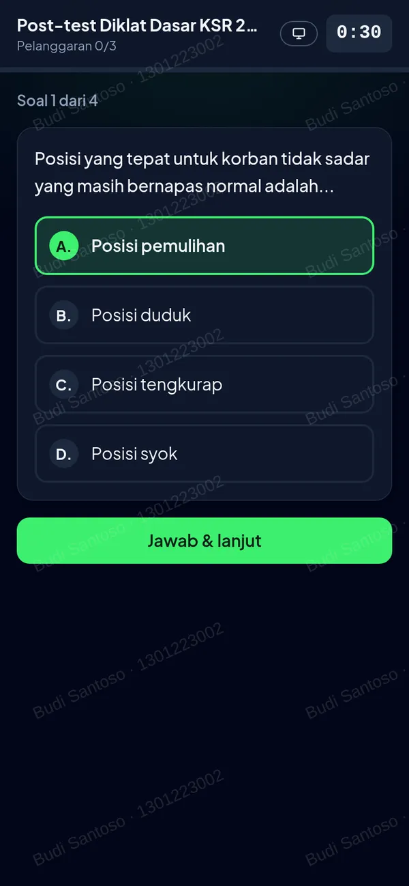<br><sub>Mode per soal (tema gelap)</sub></td>
  </tr>
</table>

- **Mode total**: semua soal tampil dalam satu halaman. Ketuk jawaban untuk memilih, dan jawaban boleh diganti. Kalau sudah selesai, tekan **Kumpulkan jawaban**, lalu konfirmasi dengan **Kumpulkan**. Kalau waktu habis, jawaban dikumpulkan otomatis.
- **Mode per soal**: soal tampil satu per satu. Pilih jawaban lalu tekan **Jawab & lanjut** (atau **Jawab & selesai** di soal terakhir). Soal yang waktunya habis **dilewati** dan dihitung salah. Soal sebelumnya **tidak bisa dibuka lagi**.
- Tombol tema (ikon monitor, matahari, atau bulan) mengganti tampilan terang/gelap. Tidak ada pengaruhnya ke ujian.

### 4.4 Pelanggaran dan peringatan

Yang dihitung pelanggaran: **pindah aplikasi atau tab**, **membuka notifikasi**, **keluar dari layar penuh**, **split screen / jendela mengecil**, dan **reload atau membuka ulang halaman ujian**.

<p align="center">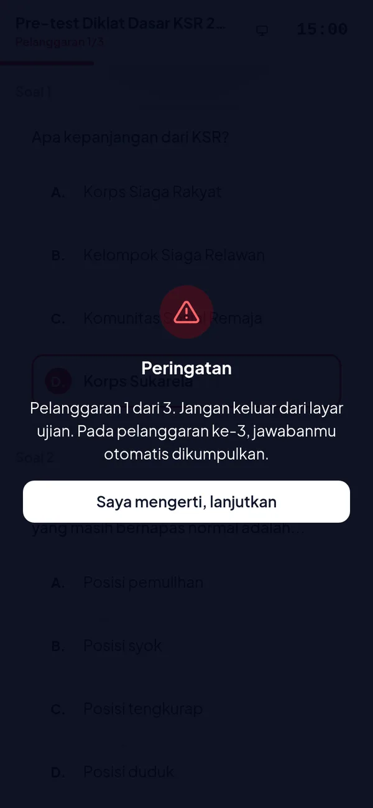</p>

Setiap pelanggaran memunculkan peringatan. Tekan **Saya mengerti, lanjutkan** untuk kembali ke layar penuh. Pada pelanggaran terakhir sesuai batas dari panitia, jawabanmu **dikumpulkan otomatis**.

> Layar HP dijaga tetap menyala selama ujian, jadi membaca soal lama-lama tidak membuat layar terkunci. Menekan tombol power tetap terhitung keluar dari ujian.

### 4.5 Selesai dan melihat nilai

Setelah jawaban terkirim, muncul ucapan selamat dan hitung mundur. Nilai muncul **serentak untuk semua peserta** setelah sesi tutup dan semua peserta selesai. Biarkan halaman terbuka, dan nilai akan muncul sendiri.

<table align="center">
  <tr>
    <td align="center">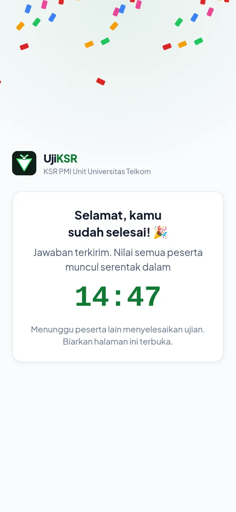<br><sub>Jawaban terkirim</sub></td>
    <td align="center">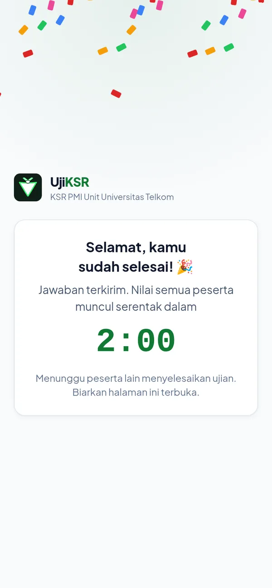<br><sub>Menunggu peserta lain</sub></td>
    <td align="center">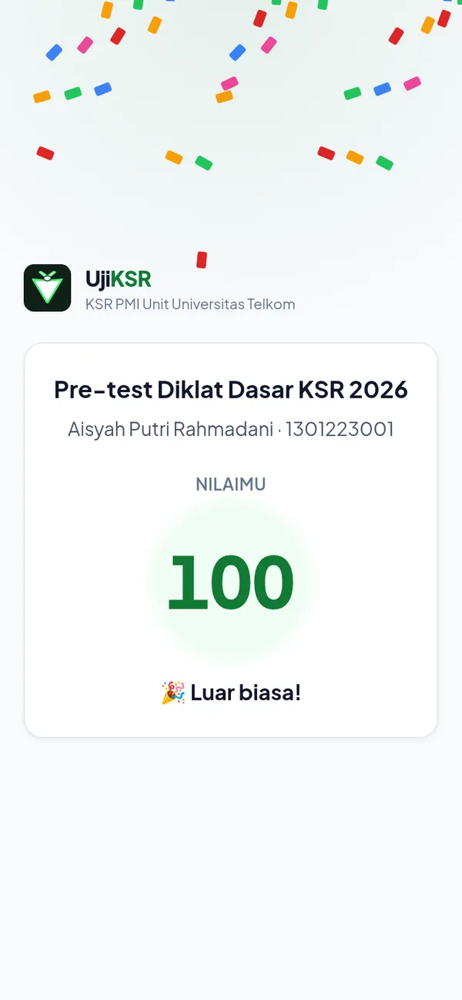<br><sub>Nilaimu</sub></td>
  </tr>
</table>

Kalau halaman sudah telanjur ditutup, buka lagi QR/link yang sama di HP yang sama, lalu tekan **Lihat nilai ujianmu**.

---

## 5. Checklist hari-H

**Sehari sebelumnya (H-1)**
- [ ] Buka `/admin` supaya database aktif. Project Supabase gratis otomatis *pause* setelah 7 hari tidak dipakai.
- [ ] Buat sesi pre-test (dan post-test), upload soal, lalu periksa kunci jawaban (✓ hijau).
- [ ] Uji coba singkat dengan 1 HP Android dan 1 iPhone memakai sesi uji. Hapus sesi uji setelahnya.
- [ ] Bagikan [Panduan peserta](#4-panduan-peserta) ke peserta.

**Sebelum mulai**
- [ ] Pastikan WiFi/sinyal ruangan cukup untuk semua peserta.
- [ ] Minta peserta mengaktifkan Jangan Ganggu dan memakai Chrome/Safari.
- [ ] Klik **Buka sesi**, lalu **Tayangkan QR & kode** di tab baru. Share tab itu saja, jangan halaman sesi yang berisi kunci jawaban.

**Selama ujian**
- [ ] Pantau tabel peserta. Tangani permintaan reset dengan cepat.
- [ ] Awasi ruangan. Aplikasi tidak bisa mendeteksi foto dari HP kedua atau contekan langsung.

**Setelah selesai**
- [ ] Tunggu sesi tutup otomatis (atau klik **Tutup sesi**) dan semua peserta selesai sampai nilai muncul.
- [ ] **Export CSV** untuk arsip.
- [ ] Setelah post-test, buka **Bandingkan pre-test vs post-test**.

---

## 6. Anti-cheat secara rinci

**Dicegah**
- **Layar penuh wajib.** Kalau peserta keluar, layar ujian terkunci sampai dia kembali ke layar penuh.
- **Tekan-lama, salin, potong, seleksi teks, dan seret diblokir.** Menu Google Lens dan copy-paste ke AI tidak bisa dipakai.
- **Watermark** nama + NIM di seluruh layar, sehingga foto atau screenshot yang tersebar bisa dilacak.
- **Layar tetap menyala** selama ujian, supaya tidak ada pelanggaran palsu karena HP terkunci otomatis.

**Dideteksi** (dicatat sebagai pelanggaran, dengan jam dan jenisnya)
- Pindah aplikasi/tab, atau membuka notifikasi.
- Hilang fokus, misalnya muncul overlay atau jendela lain.
- Keluar dari layar penuh.
- Split screen, floating window, atau jendela mengecil lebih dari 40%.
- Reload atau membuka ulang halaman ujian.

Satu kejadian yang memicu beberapa sinyal sekaligus hanya dihitung **sekali** (jeda 2 detik).

**Dijaga server**
- Waktu dihitung server, sehingga mengubah jam HP tidak berpengaruh.
- Urutan soal dan opsi jawaban **diacak** untuk tiap peserta.
- **Kunci jawaban tidak pernah dikirim ke HP**, jadi tidak bisa diintip lewat kode halaman.
- Satu NIM hanya bisa mengerjakan satu kali per sesi.
- Di mode per soal, jawaban untuk soal yang sudah lewat ditolak.
- Nilai baru dirilis setelah semua peserta selesai.

**Batasan (tidak bisa dicegah oleh aplikasi web)**
- Screenshot, atau foto layar dari HP lain. Watermark membuat pelakunya bisa dilacak.
- Peserta bertanya ke orang di sebelahnya.
- **iPhone** tidak mendukung layar penuh untuk web, jadi di iPhone yang terdeteksi adalah pindah aplikasi/tab.
- Peserta yang paham teknis di **laptop** bisa mematikan deteksi di browser, tapi aturan server (timer, kunci jawaban, urutan soal) tetap tidak bisa diakali.

**Tips pengawasan:** gunakan **mode per soal** untuk ujian yang paling ketat, batasi waktu per soal secukupnya, dan tetap tempatkan pengawas di ruangan.

---

## 7. Pertanyaan umum & pemecahan masalah

| Masalah | Penyebab & solusi |
|---|---|
| *"Sesi tidak ditemukan"* | Kode salah ketik. Scan ulang QR atau cek kode di proyektor. |
| *"Sesi ini belum dibuka atau sudah ditutup"* | Panitia belum menekan **Buka sesi**, atau sesi sudah ditutup (termasuk tutup otomatis setelah durasi ujian). Panitia bisa menekan **Buka sesi** lagi. |
| *"NIM ini sudah memulai ujian di sesi ini"* | NIM itu sudah dipakai di sesi ini. Panitia bisa menekan **Reset** di baris peserta tersebut. |
| *"Soal belum tersedia"* | Sesi dibuka tapi soalnya belum diisi. Panitia perlu menambah soal. |
| *"Ujian tidak ditemukan… scan ulang QR"* | Pengerjaan peserta sudah di-reset panitia. Scan QR lagi dan mulai ulang. |
| Layar terus terkunci | Tekan **Saya mengerti, lanjutkan**. Kalau link dibuka dari aplikasi lain (Instagram/LINE), buka ulang di Chrome atau Safari. |
| Nilai belum muncul | Sesi belum tutup, atau masih ada peserta yang mengerjakan (lihat hitung mundur). Biarkan halaman terbuka, atau buka lagi link-nya nanti. |
| Muncul *"Browser ini terlalu lama"* | Perbarui Chrome/Safari, atau pakai HP lain. Minimal Chrome 111 atau iOS 16.4. |
| Kunci jawaban ternyata salah setelah ujian | Soal terkunci selama ada peserta dan nilai dihitung saat jawaban dikumpulkan. Export CSV lalu koreksi manual, atau **Reset semua**, perbaiki soal, dan ulangi ujiannya (semua jawaban hilang). Karena itu, periksa kunci sebelum membuka sesi. |
| Panel admin: *"Database belum bisa diakses"* | Project Supabase ter-*pause* atau konfigurasi berubah. Buka dashboard Supabase dan klik *Restore project*, lalu coba lagi. |
| Lupa password admin | Pengelola mengganti `ADMIN_PASSWORD` di Vercel (Settings → Environment Variables), lalu **Redeploy**. |

---

## 8. Lampiran

### A. Format CSV soal

Baris pertama adalah judul kolom: `type,question,a,b,c,d,e,answer`.

| Kolom | Isi |
|---|---|
| `type` | `pg` = pilihan ganda, `bs` = benar/salah |
| `question` | Teks soal. Kalau berisi koma, bungkus dengan tanda kutip `"…"`. |
| `a` … `e` | Opsi pilihan ganda, diisi berurutan mulai `a`, minimal 2. Kosongkan untuk `bs`. |
| `answer` | Huruf opsi benar (`A`–`E`) untuk `pg`. `B` (benar) atau `S` (salah) untuk `bs`. |

```csv
type,question,a,b,c,d,e,answer
pg,Apa kepanjangan dari KSR?,Korps Sukarela,Kelompok Siaga Relawan,Komunitas Sosial Remaja,Korps Siaga Rakyat,,A
bs,"Pada luka bakar ringan, bagian yang terbakar didinginkan dengan air mengalir.",,,,,,B
```

### B. Rumus nilai

**Nilai = jumlah jawaban benar ÷ jumlah soal × 100**, dibulatkan. Soal yang tidak dijawab atau dilewati karena waktunya habis dihitung salah.

### C. Jenis pelanggaran di log

| Tertulis di log | Kejadian |
|---|---|
| pindah aplikasi/tab | Peserta berpindah aplikasi/tab, membuka notifikasi, atau layar dimatikan. |
| hilang fokus | Jendela ujian kehilangan fokus (overlay atau jendela lain). |
| keluar layar penuh | Peserta keluar dari mode layar penuh. |
| layar mengecil (split screen) | Split screen, floating window, atau jendela mengecil. |
| membuka ulang ujian | Halaman ujian di-reload atau dibuka ulang. |
